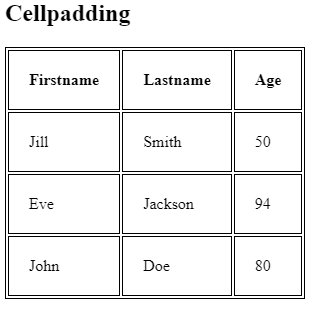
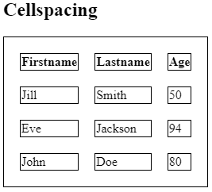
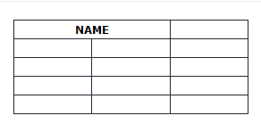

# HTML5

HTML stands for **HyperText Markup Language** , which is a markup language used for creating web pages and web applications.  
It defines the structure and content of a web page, using tags and attributes to mark up elements such as headings, paragraphs, images, links, and more

## Structure of Html

`<!DOCTYPE>` : This declaration specifies the version of HTML being used in the document  
`<html>` : The `<html>` element is the root element of an HTML page. It contains all other elements of the page  
`<head>` : The `<head>`element contains meta-information about the HTML document, such as the title of the page, links to external stylesheets or scripts, and other metadata  
`<title>` : The `<title>`element is placed within the`<head>`element and defines the title of the HTML document, which is displayed in the browser's title bar or tab  
`<body>` : The `<body>` element contains the visible content of the HTML document, such as headings, paragraphs, images, links, and other elements

Example

```html
<!DOCTYPE html>
<html>
  <head>
    <title>My First HTML Page</title>
  </head>
  <body>
    <h1>Welcome to My Website</h1>
    <p>This is a paragraph of text.</p>
    
    <a href="https://www.example.com">Click here</a>
  </body>
</html>
```

## HTML Elements:

- HTML elements are the building blocks of an HTML document.
- Each HTML element is defined by a start tag, some content, and an end tag.  
  Examples of HTML elements include `<h1>` for headings, `<p>` for paragraphs, `` for images, and `<a>` for links
- Some HTML elements, called empty elements, do not have an end tag, such as `<br>` for line breaks.

## Nested HTML Elements:

- HTML elements can be nested, meaning that elements can contain other elements.
- Proper nesting requires that the entire nested element, including its markup, is within the start and end tags of the containing element (the parent)  
  For example, you can nest a `<p>` element inside a `<div>` element:

```html
<div>
  <p>This is a nested paragraph.</p>
</div>
```

- Nesting allows for hierarchical structuring of content and applying multiple HTML tags to a single piece of content

## Attributes:

- HTML elements can also have attributes, which provide additional information about the element.
- Attributes are specified within the start tag of an element and consist of a name and a value.  
  For example, the `` element has attributes like src (specifying the image source) and alt (providing alternative text for the image)
- Attributes can be used to control the behavior, appearance, and functionality of HTML elements.

## HTML Styles:

- HTML styles are used to add visual formatting to HTML elements, such as color, font, size, and more
- CSS (Cascading Style Sheets) is the language used to define the styles in HTML
- CSS provides a wide range of properties and values that can be used to customize the appearance of HTML elements
- Styles in HTML can be applied using different methods, including **inline styles**, **embedded styles**, and **external stylesheets**

#### 1. **Inline Style:** In this method, the style attribute is used directly within the HTML start tag of an element. The style attribute includes a series of CSS property and value pairs separated by semicolons

Example

```html
<p style="color: red; font-size: 18px;">
  This is a red paragraph with a font size of 18 pixels.
</p>
```

#### 2. **Embedded Style:** In this method, the style element is used within the `<head>` element of the HTML document. CSS rules are written inside the style element

Example

```html
<head>
  <style>
    p {
      color: blue;
      font-size: 20px;
    }
  </style>
</head>
<body>
  <p>This is a blue paragraph with a font size of 20 pixels.</p>
</body>
```

#### 3. **External Style:** In this method, the `<link>` element is used to link an external CSS file to the HTML document. The CSS rules are defined in the external file

```html
<link rel="stylesheet" href="./style.css" />
```

- It's important to note that while inline styles are quick and easy to implement, it is generally recommended to use external stylesheets for larger projects as they provide better organization and maintainability.

## HTML Links

- HTML links are used to create clickable elements that allow users to navigate between different web pages or sections within a page.
- The `<a>` tag is used to define a hyperlink, and the href attribute specifies the destination of the link

```html
<a href="https://www.example.com">Click here</a>
```

This link will display the text "Click here" and when clicked, it will navigate to the URL specified in the href attribute.

### Image as a Link:

You can use an image as a link by wrapping the `` tag inside an `<a>` tag

```html
<a href="https://www.example.com">
  
</a>
```

In this example, the image will be displayed, and when clicked, it will navigate to the URL specified in the href attribute.

### Button as a Link:

You can also use a button as a link by styling it to look like a link and adding an onclick attribute to handle the click event

```html
<button onclick="window.location.href='https://www.example.com'">
  Click here
</button>
```

When the button is clicked, it will navigate to the specified URL.

### Link Bookmarks:

- Link bookmarks, also known as anchor links, allow you to link to a specific section within the same web page.
- To create a bookmark, you need to assign an id attribute to the element you want to link to, and then use the # symbol followed by the id in the href attribute of the link

```html
<h2 id="section1">Section 1</h2>
<p>This is the content of section 1.</p>

<a href="#section1">Go to Section 1</a>
```

In this example, clicking on the link will scroll the page to the section with the id "section1".

### Image Maps:

- Image maps allow you to define clickable areas on an image, where each area can link to a different destination.
- Image maps are created using the `<map>`,` <area>`, and `` tags.
- The `<map>` tag defines the image map, the `<area>` tags define the clickable areas, and the `` tag specifies the image to be used.

```html


<map name="map">
  <area shape="rect" coords="0,0,100,100" href="link1.html" />
  <area shape="circle" coords="150,150,50" href="link2.html" />
</map>
```

In this example, the image is divided into two clickable areas: a rectangle and a circle. Clicking on each area will navigate to a different URL

## HTML Lists

- HTML lists are used to group a set of related items in an ordered or unordered form.  
  There are three types of lists in HTML:

### 1. Unordered List

- This type of list is created using the `<ul>` tag and each item in the list is defined using the `<li>` tag.
- Unordered lists have bullet points next to each item by default.

```html
<ul>
  <li>Item 1</li>
  <li>Item 2</li>
  <li>Item 3</li>
</ul>
```

### 2. Ordered List

- This type of list is created using the `<ol>` tag and each item in the list is defined using the `<li>` tag.
- Ordered lists have numbers next to each item by default.

```html
<ol>
  <li>Item 1</li>
  <li>Item 2</li>
  <li>Item 3</li>
</ol>
```

### 3. Description List

- This type of list is created using the `<dl>` tag, the term or name for each item in the list is defined using the `<dt>` tag,  
  and the description for each term is defined using the `<dd>` tag.

```html
<dl>
  <dt>Term 1</dt>
  <dd>Description 1</dd>
  <dt>Term 2</dt>
  <dd>Description 2</dd>
</dl>
```

## HTML Tables

- HTML tables allow web developers to arrange data into rows and columns.
- A table in HTML consists of table cells inside rows and columns.
- The basic structure of an HTML table is defined with the `<table> `tag, and each table row is defined with the `<tr>` tag
- A table header is defined with the `<th>` tag, while a table data/cell is defined with the `<td>` tag

```html
<table>
  <tr>
    <th>Company</th>
    <th>Contact</th>
  </tr>
  <tr>
    <td>Alfreds Futterkiste</td>
    <td>Maria Anders</td>
  </tr>
  <tr>
    <td>Centro comercial Moctezuma</td>
    <td>Francisco Chang</td>
  </tr>
</table>
```

| Company                    | Contact         |
| -------------------------- | --------------- |
| Alfreds Futterkiste        | Maria Anders    |
| Centro comercial Moctezuma | Francisco Chang |

The main HTML table tags are:

- `<table>`: Defines a **table**.
- `<tr>`: Defines a **table row**.
- `<th>`: Defines a **table header** cell.
- `<td>`: Defines a **table data** cell.
- `<caption>`: Defines a table caption.
- `<thead>`: Defines a group of header rows in a table.
- `<tbody>`: Defines a group of body rows in a table.
- `<tfoot>`: Defines a group of footer rows in a table.
- `<col>`: Defines a column within a table and is used for applying styles to columns.
- `<colgroup>`: Defines a group of one or more columns in a table for formatting purpose

HTML tables provide the ability to control the **padding** and **spacing** between cells, as well as the ability to merge cells using the **colspan** and **rowspan** attributes.

### Padding

- The cellpadding attribute is used to define the **space between the border of a table cell and its contents**.
- It specifies the whitespace between the cell edge and the content of the cell.
- Default is 0
  Here is an example:

```html
<table cellpadding="20">
  <tr>
    <td>Cell 1</td>
    <td>Cell 2</td>
  </tr>
  <tr>
    <td>Cell 3</td>
    <td>Cell 4</td>
  </tr>
</table>
```



### Spacing

- The cellspacing attribute is used to define the space between cells, which means it specifies the whitespace between the edges of adjacent cells.
- Default space is 2px
  Here is an example:

```html
<table cellspacing="20">
  <tr>
    <td>Cell 1</td>
    <td>Cell 2</td>
  </tr>
  <tr>
    <td>Cell 3</td>
    <td>Cell 4</td>
  </tr>
</table>
```



### Colspan

- The colspan attribute is used to make a cell span over multiple columns.
- It specifies the number of columns that the cell should span.  
   example:
  ` <th colspan="2">Name</th>`  
  

### Rowspan

- The rowspan attribute is used to make a cell span over multiple rows.
- It specifies the number of rows that the cell should span.  
  example:  
  `<th rowspan="2">April</th>`  
  

## Main Tags

- `<html>`
- `<head>`
- `<title>`
- `<meta>`
- `<link>`
- `<style>`
- `<script>`
- `<body>`
- `<header>`
- `<nav>`
- `<main>`
- `<section>`
- `<article>`
- `<aside>`
- `<footer>`
- `<h1>`, `<h2>`, `<h3>`, `<h4>`, `<h5>`, `<h6>`
- `<p>`
- `<a>`
- ``
- `<ul>`
  - `<ol>`
  - `<li>`
- `<table>`
  - `<tr>`
  - `<th>`
  - `<td>`
- `<form>`
  - `<input>`
  - `<label>`
  - `<select>`
  - `<option>`
  - `<button>`

## Expanded Main

- `<!DOCTYPE html>` : This tag tells the browser what version of HTML the document is written in.
- `<html>` : This tag marks the beginning of the HTML document.
- `<head>` : This tag contains information about the document, such as the title, author, and keywords.
- `<title>` : This tag defines the title of the document.
- `<meta>` : This tag contains metadata about the document, such as the description, keywords, and author.
- `<body>` : This tag marks the beginning of the body of the document.
- `<h1>` to `<h6>` : These tags define headings of different sizes.
- `<p>` : This tag defines a paragraph.
- `<br>` : This tag inserts a line break.
- `<a>` : This tag defines a hyperlink.
- `` : This tag defines an image.
- `<table>` : This tag defines a table.
- `<tr>` : This tag defines a row in a table.
- `<td>` : This tag defines a cell in a table.
- `<ul>` : This tag defines an unordered list.
- `<li>` : This tag defines an item in an unordered list.
- `<ol>` : This tag defines an ordered list.
- `<li>` : This tag defines an item in an ordered list.
- `<form>` : This tag defines a form.
- `<input>` : This tag defines an input field.
- `<button>` : This tag defines a button.
- `<select>` : This tag defines a drop-down menu.
- `<option>` : This tag defines an option in a drop-down menu.
- `<textarea>` : This tag defines a text area.
- `<iframe>` : This tag defines an embedded frame. inline frame for embedding external content within another web page.

## All Tags

- `<a>` : Defines a hyperlink.
- `<abbr>` : Defines an abbreviation or acronym.
- `<address>` : Defines contact information for the author/owner of a document.
- `<area>` : Defines an area inside an image map.
- `<article>` : Defines an article.
- `<aside>` : Defines content aside from the page content.
- `<audio>` : Defines sound content.
- `<b>` : Defines bold text.
- `<base>` : Defines the base URL for all relative URLs in a document.
- `<bdi>` : Defines a part of text that might be formatted in a different direction from other text outside it.
- `<bdo>` : Defines the direction of text display.
- `<blockquote>` : Defines a section that is quoted from another source.
- `<body>` : Defines the document's body.
- `<br>` : Defines a line break.
- `<button>` : Defines a clickable button.
- `<canvas>` : Defines graphics.
- `<caption>` : Defines a table caption.
- `<cite>` : Defines the title of a work.
- `<code>` : Defines computer code text.
- `<col>` : Defines a column within a table.
- `<colgroup>` : Defines a group of columns within a table.
- `<data>` : Associates a piece of content with a machine-readable value.
- `<datalist>` : Defines a list of pre-defined options for input controls.
- `<dd>` : Defines a description of an item in a description list.
- `<del>` : Defines text that has been deleted from a document.
- `<details>` : Defines additional details that the user can view or hide.
- `<dfn>` : Defines a definition term.
- `<dialog>` : Defines a dialog box or window.
- `<div>` : Defines a section of a document.
- `<dl>` : Defines a description list.
- `<dt>` : Defines a term (an item) in a description list.
- `<em>` : Defines emphasized text.
- `<embed>` : Defines an external interactive content or plugin.
- `<fieldset>` : Defines a set of related form controls.
- `<figcaption>` : Defines a caption for a `<figure>` element.
- `<figure>` : Defines self-contained content, such as images or diagrams.
- `<footer>` : Defines a footer for a document or section.
- `<form>` : Defines a form for user input.
- `<h1>` to `<h6>`: Defines headings of different levels.
- `<head>` : Defines information about the document.
- `<header>` : Defines a header for a document or section.
- `<hr>` : Defines a thematic break between paragraphs.
- `<html>` : Defines the root of an HTML document.
- `<i>` : Defines italicized text.
- `<iframe>` : Defines an inline frame.
- `` : Defines an image.
- `<input>` : Defines an input control.
- `<ins>` : Defines text that has been inserted into a document.
- `<kbd>` : Defines keyboard input.
- `<label>` : Defines a label for an input element.
- `<legend>` : Defines a caption for a `<fieldset>` element.
- `<li>` : Defines a list item.
- `<link>` : Defines a link between a document and an external resource.
- `<main>` : Defines the main content of a document.
- `<map>` : Defines an image map.
- `<mark>` : Defines marked/highlighted text.
- `<meta>` : Defines metadata about a document.
- `<meter>` : Defines a scalar measurement within a known range.
- `<nav>` : Defines navigation links.
- `<noscript>` : Defines content to be displayed if scripting is not supported.
- `<object>` : Defines an embedded object.
- `<ol>` : Defines an ordered list.
- `<optgroup>` : Defines a group of related options in a drop-down list.
- `<option>` : Defines an option in a drop-down list.
- `<output>` : Defines the result of a calculation.
- `<p>` : Defines a paragraph.
- `<param>` : Defines a parameter for an object.
- `<picture>` : Defines a container for multiple image sources.
- `<pre>` : Defines preformatted text.
- `<progress>` : Defines the progress of a task.
- `<q>` : Defines a short quotation.
- `<rp>` : Defines what to show in browsers that do not support ruby annotations.
- `<rt>` : Defines an explanation or pronunciation of characters (for East Asian typography).
- `<ruby>` : Defines a ruby annotation (for East Asian typography).
- `<s>` : Defines text that is no longer accurate or relevant.
- `<samp>` : Defines sample output from a computer program.
- `<script>` : Defines a client-side script.
- `<section>` : Defines a section of a document.
- `<select>` : Defines a drop-down list.
- `<small>` : Defines smaller text.
- `<source>` : Defines multiple media resources for media elements.
- `<span>` : Defines a small section of a document.
- `<strong>` : Defines strong text.
- `<style>` : Defines style information for a document.
- `<sub>` : Defines subscripted text.
- `<summary>` : Defines a visible heading for a `<details>` element.
- `<sup>` : Defines superscripted text.
- `<svg>` : Defines scalable vector graphics.
- `<table>` : Defines a table.
- `<tbody>` : Defines the body of a table.
- `<td>` : Defines a cell in a table.
- `<template>` : Defines a container for content that should not be displayed when the page loads.
- `<textarea>` : Defines a multi-line input control.
- `<tfoot>` : Defines the footer of a table.
- `<th>` : Defines a header cell in a table.
- `<thead>` : Defines the header of a table.
- `<time>` : Defines a date/time.
- `<title>` : Defines the title of a document.
- `<tr>` : Defines a row in a table.
- `<track>` : Defines text tracks for media elements.
- `<u>` : Defines underlined text.
- `<ul>` : Defines an unordered list.
- `<var>` : Defines a variable.
- `<video>` : Defines a video.
- `<wbr>` : Defines a possible line break.

Note that this is not an exhaustive list, and there are other HTML tags that are not included here.

### Example / Syntax

```

```

```

```
